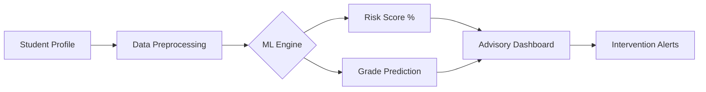

# 🎓 Student Performance Prediction System (EduGuard)

EduGuard is an industry-oriented predictive analytics system that identifies students at risk of academic failure using semester-long signals like attendance, quiz scores, and engagement.

 *Example Dashboard Visual*

---

## 1️⃣ Project Explanation
**What is it?**  
A machine learning solution that processes student behavioral data to predict end-term outcomes (Pass/Fail or Grade Bands).

**Why is it important?**
- **Dropout Prevention:** Schools can intervene weeks before a student fails.
- **Personalized Learning:** Identifying specific weak areas (e.g., midterm scores vs. attendance).
- **Resource Allocation:** Focusing tutoring sessions on students with highest risk scores.

**Workflow:**
`Student Data` → `Cleaning & Feature Engineering` → `ML Model (Random Forest/XGBoost)` → `Risk Prediction` → `Actionable Insights`

---

## 2️⃣ Tech Stack
- **Frontend:** Next.js / React (Modern UI/UX)
- **Backend:** Node.js + Express (API Layer)
- **Inference:** Gemini 2.0 AI (Explainable Analysis)
- **Visualization:** Recharts & D3.js
- **Styling:** Tailwind CSS 4.0

---

## 3️⃣ System Architecture


---

## 4️⃣ Implementation Phases
| Phase | Goal | Key Task |
| :--- | :--- | :--- |
| **Setup** | Environment ready | Install dependencies & project structure |
| **Data** | Quality data | Generate synthetic student personas |
| **Preprocessing** | Data readiness | Normalization & encoding |
| **Modeling** | High accuracy | Training Random Forest / XGBoost |
| **Integration** | Live API | Exposing models via FastAPI/Express |
| **Frontend** | Insights UI | Building a dashboard for teachers |

---

## 5️⃣ Folder Structure
```text
Student-Performance-Prediction/
│
├── data/           # Synthetic CSV datasets
├── notebooks/      # EDA and Python training scripts
├── src/            # Frontend (React/TypeScript)
├── models/         # Trained Model Serialization
├── outputs/        # Generated Reports & Plots
├── images/         # UI Screenshots & Diagrams
├── README.md       # Project Documentation
├── requirements.txt# Python dependencies
└── main.py         # Model training script
```

---

## 6️⃣ Installation & Run
1. **Clone the Repo**
2. **Install Frontend:** `npm install`
3. **Set API Key:** Add `GEMINI_API_KEY` to `.env`
4. **Run Dev Server:** `npm run dev`

---

## 7️⃣ Interview Preparation (Proof Strategy)
- **Day 1:** Understand the Business Problem (Retention vs Academic Success).
- **Day 2:** Data Cleaning and EDA.
- **Day 3:** Model Selection (Classification vs Regression).
- **Day 4:** Deployment and Dashboard Integration.

**Interview Tip:** Be ready to explain *why* attendance is a stronger predictor than quiz scores in early-stage risk detection.

---
*Developed for professional placement readiness in Data Science and ML Engineering.*
